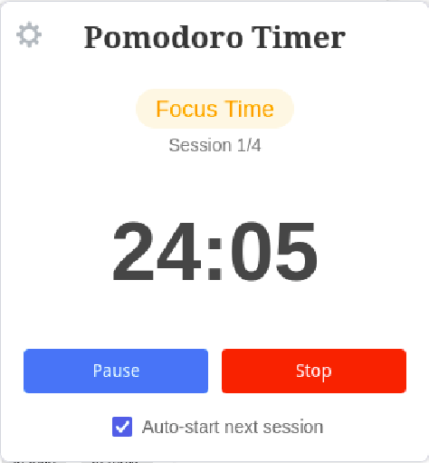

# Pomodoro Timer Firefox Extension

A Pomodoro timer extension for Firefox that helps you stay focused and manage your work sessions effectively.

## Features

- 🎯 Customizable work/break durations
- ⚡ Auto-start next sessions
- 🔄 Configurable long break intervals
- 🎨 Clean, modern interface
- 💾 Persistent state tracking
- ⏭️ Skip break option
- ⏹️ Stop/Reset functionality

## Usage

1. Click the extension icon in your browser toolbar to open the timer
2. Set your preferred durations in the settings:
   - Work duration (1-60 minutes)
   - Short break duration (1-60 minutes)
   - Long break duration (1-60 minutes)
   - Sessions before long break (1-10 sessions)
3. Use the control buttons to:
   - Start/Pause the timer
   - Stop the current session
   - Reset the timer
   - Skip breaks when needed

The extension will automatically track your progress through work and break sessions, with a longer break after completing your configured number of work sessions.

## Settings

Access the settings page by clicking the gear icon (⚙️) to customize:

- Work duration
- Short break duration
- Long break duration
- Number of sessions before long break
- Auto-start preference

## License

This project is open source and available under the [MIT License](LICENSE).
